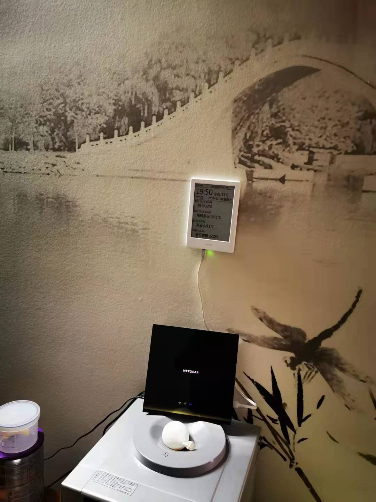

golang server for generating weather report PNG with juhe 聚合 [API](https://www.juhe.cn/box/index/id/73)

like:

kindle on the wall in real:

to run, you need define environment variables: TTF_PATH for TTF font and JUHE_APIKEY for API keyx
